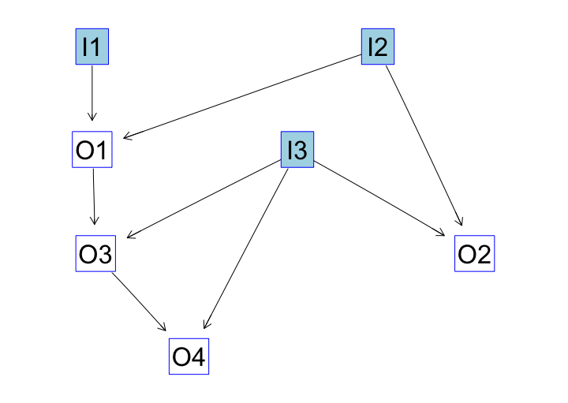

<!-- README.md is generated from README.Rmd. Please edit that file -->

[](https://travis-ci.org/neuroimaginador/wf4ni)

# The `wf4ni` package

There are a lot of packages in the R ecosystem focused on several
aspects of Neuroimage processing, many of them listed in the [CRAN Task
View: Medical Imaging](https://CRAN.R-project.org/view=MedicalImaging)
section: `oro.nifti`, `oro.dicom`, `RNifti`, `fmri`, `divest` (among
others) for reading/writing of images; `ANTsR`, `fslr` for more advanced
processing methods; `RNiftyReg` specialized in registration, `mritc`
focused in image segmentation. Many more, for DTI, fMRI, molecular
imaging, and visualization are available in
[CRAN](https://CRAN.R-project.org).

However, to get a complete Neuroimaging pipeline working, it is common
to rely on several different packages, and, in general, no single
package can offer all the functionalities desired. Tracking the
requirements and dependencies of a pipeline is time-consuming, since the
user has to manually find, for each function used, the packages it
depends on.

In addition, the most typical form of building a pipeline in R is via
scripting. Once the needed functions are defined or imported from a
third-party package, one or more scripts are written in order to get all
processes done.

But scripts are error-prone, difficult to trace and debug if the script
is large, and require some level of customization when one tries to run
the script in a different environment (computer, laboratory…). These
cons make us think of defining self-contained workflows, easily
shareable, which can perform the same operations as a script but with
greater legibility and traceability.

The goal of this package is to provide certain features to manage the
situations before:

  - **Simple definition of Neuroimaging flows**, which can incorporate
    any `R` function (including those from other packages, such as
    `ANTsR` or `fslr`) as a part of it. At definition time, the package
    warns about inconsistencies on the flow from inputs to outputs
    (undefined functions or variables).
  - Creation of a **common interface for the execution** of Neuroimaging
    workflows, reducing the need of constantly looking up in the
    documentation of several packages. Instead of using a different
    syntax for each function, just *execute* the flow, specifying the
    required outputs, and all associated functions are run in the right
    order to get the results.
  - Ability to **automatically track dependencies**. Every time a new
    function or process is inserted into a flow, the *flow* object tries
    to guess its dependencies, by looking up in the different loaded
    namespaces, and storing (internally) this information to be used in
    the export stage.
  - **Workflows can be shared** across multiple systems. A *flow* object
    can be exported and saved as a regular .zip file, and then reloaded
    in a different computer. When importing a flow, the package detects
    (from in internals) if there are missing dependencies (packages not
    installed on the system) and prompts the user to install them.
  - **Extensibility**. A node in the workflow is a single function in
    `R`, that is, something that can be computed in runtime. This means
    that a process in the pipeline can be, for example, a function to
    generate a plot, or to compute image statistics, or a function that
    wraps a random forest which has been previously trained to infer a
    labelling on the input image. The `wf4ni` package provides the tools
    to extend this functionality to other *computations*: machine
    learning or deep learning models, for instance.
  - **Simple memory management**. The memory used by intermediate
    outputs when running a flow is automatically released when those
    outputs are no longer needed for further results, thus keeping the
    memory footprint as small as possible.
  - Work natively with **NIfTI files**.

## Requirements

The following packages are imported by `wf4ni`:

> stringr, styler, devtools, igraph, RCurl, R6, RNifti, neurobase,
> oro.nifti, scales, zip, crayon, prettyunits, pryr, purrr, methods,
> utils

Please, install them before attempting the installation of `wf4ni`:

``` r
install.packages(c("stringr", "styler", "devtools", "igraph", "RCurl",
                   "R6", "RNifti", "neurobase", "oro.nifti", "scales",
                   "zip", "crayon", "prettyunits", "pryr", "purrr"))
```

## Installation

Currently, this package is not in CRAN. The only way to get this package
installed is by using the `devtools` package and installing `wf4ni` from
GitHub:

``` r
devtools::install_github("neuroimaginador/wf4ni")
```

<!-- You can install the released version of wf4ni from [CRAN](https://CRAN.R-project.org) with: -->

<!-- ``` r -->

<!-- install.packages("wf4ni") -->

<!-- ``` -->

## The `wf4ni` model

In `wf4ni`, a *flow* is an ordered collection of processes that convert
inputs into outputs, such that the output of a process may be the input
to another one.

By defining the appropriate functions, one can model the pipeline in the
correct order and obtain a flow as the one depicted in the following
figure:



Original inputs in the *flow* are *I1*, *I2* and *I3* (in blue). Other
nodes represent the output of a given function, using the incident nodes
as inputs for that function.

A *flow* object stores information about the functions used and their
relationships, building what is called a *computation graph*.

## Examples

A simple example:

``` r
library(wf4ni)

f <- function(a, b) {a + b}

my_flow <- NIflow$new(name = "test", inputs = c("I1", "I2"))

my_flow$add(what = f, inputs = c("I1", "I2"), output = "O1")
my_flow$add(inputs = "I3")
my_flow$add(what = f, inputs = c("I2", "I3"), output = "O2")
my_flow$add(what = f, inputs = c("O1", "I3"), output = "O3")
my_flow$add(what = f, inputs = c("O3", "I3"), output = "O4")

my_flow$plot()
```

This flow produces the pipeline shown in the figure above. It is not
retricted to NIfTI images, as the function *f* used to define some of
the outputs is not designed specifically for Neuroimaging (it is just
the sum of its two arguments).

By
using

``` r
my_flow$execute(inputs = list(I1 = 3, I2 = 2), desired_outputs = c("O1"))

my_flow$execute(inputs = list(I1 = 3, I2 = 2, I3 = 4), 
                desired_outputs = c("O1", "O2", "O4"))
```

we obtain, in the first case, a list with just one field named “O1”
whose value corresponds to the application of the workflow up to the
required output. In the second case, the list contains fields “O1”, “O2”
and “O4”, with the corresponding
values.

``` r
> my_flow$execute(inputs = list(I1 = 3, I2 = 2), desired_outputs = c("O1"))
$O1
[1] 5

> my_flow$execute(inputs = list(I1 = 3, I2 = 2, I3 = 4), 
                  desired_outputs = c("O1", "O2", "O4"))
$O1
[1] 5

$O2
[1] 6

$O4
[1] 13
```

More advanced examples, with applications to common pipelines in
Neuroimaging, are in the vignettes of this package.

<!-- ## Extensibility of `wf4ni` -->
