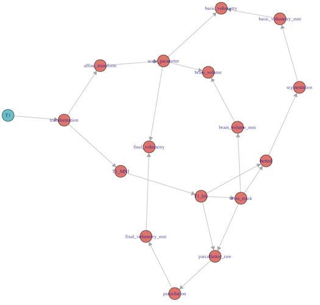

  
```{r setup, include = FALSE}
  knitr::opts_chunk$set(
  collapse = TRUE,
  comment = "#>",
  eval = FALSE
  )
```
  
# Objective
  
# Requirements
  
## Packages
  
## Other Resources
  
# Segmentation
  
## Preprocessing
  
### Auxiliary Functions
  
```{r}
# - register to a template (MNI152 in case of structural imaging)
# Returns the transformation, as declared in the ANTsRCore package
register_to_template <- function(image, atlas_name) {
  
  require(ANTsRCore)
  require(ANTsR)
  require(extrantsr)
  
  image <- check_ants(image)
  
  template <- check_ants(get_atlas(atlas_name))
  
  transform <- antsRegistration(fixed = template,
                                moving = image,
                                typeofTransform = "AffineFast",
                                verbose = TRUE)
  
  return(transform)
  
} 

# Returns the image reoriented in the template space
get_img_in_template <- function(tx) {
  
  check_nifti(tx$warpedmovout)
  
}

# Returns the affine transformation
get_tx_to_template <- function(tx) {
  
  matrix(extrantsr::read_transformlist(tx$fwdtransforms)[[1]]$AffineTransform.float.3.3[1:9],
         nrow = 3, ncol = 3)
  
}

# Returns the scale parameter as the determinant of the affine trasnformation
get_scale_parameter <- function(M) {
  
  det(M)
  
}

# - bias field correction
bfc <- function(img) {
  
  image2 <- as.antsImage(img)
  
  image2 <- ANTsRCore::n4BiasFieldCorrection(img = image2, verbose = TRUE)
  
  return(ants2oro(image2, reference = img))
  
}

# - brain extraction
# Uses MALF technique with a "brain extraction" dataset
# Returns the brain mask
make_brain_extraction <- function(image, num_subjects = NULL) {
  
  problem <- "brain_extraction"
  problem_path <- problem %>% get_dataset()
  
  inputs <- list.files(file.path(problem_path, "inputs", "T1"), full.names = TRUE)
  outputs <- list.files(file.path(problem_path, "outputs"), full.names = TRUE)
  
  if (!is.null(num_subjects) && is.numeric(num_subjects)) {
    
    inputs <- inputs[seq(num_subjects)]
    outputs <- outputs[seq(num_subjects)]
    
  } else {
    
    num_subjects <- length(inputs)
    
  }
  
  L <- utils4ni::register_malf(image = oro2ants(image), 
                               template_files = inputs, 
                               label_files = outputs)
  
  templates <- L$templates
  labels <- L$labels
  
  rm(L)
  gc()
  
  label_ids <- c(0, 1)
  
  M <- max(templates[, , , 1])
  
  image <- image / (max(image, na.rm = TRUE)) * M
  
  res <- utils4ni::fast_malf(input_image = image,
                             mask = NULL,
                             template4D = templates,
                             labels4D = labels, 
                             label_ids = label_ids, 
                             patch_size = 9, 
                             kernel_width = 3, 
                             max_iter = 10,
                             method = "mi", 
                             ncores = parallel::detectCores())
  
  return(res)
  
}


```

### Flow code

```{r}
volumetry_flow <- NIflow$new(name = "volumetry", 
                             inputs = "T1")

volumetry_flow$add(what = register_to_template, 
                   inputs = "T1", 
                   output = "transformation", 
                   atlas_name = "MNI152_T1") 

volumetry_flow$add(what = get_img_in_template, 
                   inputs = "transformation", 
                   output = "T1_MNI")

volumetry_flow$add(what = get_tx_to_template, 
                   inputs = "transformation", 
                   output = "affine_transform")

volumetry_flow$add(what = get_scale_parameter, 
                   inputs = "affine_transform", 
                   output = "scale_parameter")

volumetry_flow$add(what = bfc, 
                   inputs = "T1_MNI", 
                   output = "T1_bfc")

volumetry_flow$add(what = make_brain_extraction, 
                   inputs = "T1_bfc", 
                   output = "brain_mask", 
                   num_subjects = 5)

volumetry_flow$add(what = function(A, B) {A * B}, 
                   inputs = c("T1_bfc", "brain_mask"), 
                   output = "betted")


```

## Processing
  
### Auxiliary Functions
  
```{r}
# - segmentation (GM, WM an CSF)
# Uses ANTsR's atropos to find a segmentation into GM, WM and CSF
# Returns the segmentation as a labelled image with labels 0 (background),
# 1 (CSF), 2 (GM) and 3 (WM)
get_segmentation <- function(img, kmask = NA) {
  
  q <- img %>% as.vector() %>% quantile(probs = c(0.01, 1))
  img[img < q[1]] <- q[1]
  img[img > q[2]] <- q[2]
  kmimg <- as.antsImage((img - q[1]) / (q[2] - q[1]))
  img <- as.antsImage(img)
  
  dim <- kmimg@dimension
  pixeltype <- kmimg@pixeltype
  
  if (is.na(kmask)) {
    
    kmask <- getMask(kmimg, 0.01, 1, cleanup = 2)
    
  } else {
    
    kmask <- as.antsImage(kmask)
    
  }
  
  mrf <- 0.1
  k <- 3
  
  kmask <- iMath(kmask, "FillHoles") %>% thresholdImage(1, 2)
  nhood <- paste(rep(1, dim), collapse = "x")
  mrf <- paste("[", mrf, ",", nhood, "]", sep = "")
  kmimg <- atropos(a = kmimg, m = mrf, 
                   c = "[5,0]", 
                   i = paste("kmeans[", 
                             k, "]", sep = ""), 
                   verbose = TRUE, x = kmask)
  
  kmimg$segmentation <- antsImageClone(kmimg$segmentation, 
                                       pixeltype)
  
  return(kmimg$segmentation %>% as.array())
  
}
```

### Flow code

```{r}
volumetry_flow$add(what = get_segmentation, 
                   inputs = "betted", 
                   output = "segmentation")

```


# Parcellation

## Auxiliary Functions

```{r}
# - parcellation
# Uses MALF technique with a previously labelled dataset
make_parcellation <- function(image, mask, num_subjects = NULL) {
  
  problem <- "parcellation"
  problem_path <- problem %>% get_dataset()
  
  inputs <- list.files(file.path(problem_path, "inputs", "T1"), full.names = TRUE)
  outputs <- list.files(file.path(problem_path, "outputs", "transformed"), full.names = TRUE)
  
  if (!is.null(num_subjects) && is.numeric(num_subjects)) {
    
    num_subjects <- min(c(num_subjects, length(inputs)))
    
    inputs <- inputs[seq(num_subjects)]
    outputs <- outputs[seq(num_subjects)]
    
  } else {
    
    num_subjects <- length(inputs)
    
  }
  
  # Only brain tissue
  image[mask == 0] <- 0
  
  L <- utils4ni::register_malf(image = oro2ants(image), 
                               template_files = inputs, 
                               label_files = outputs)
  
  templates <- L$templates
  labels <- L$labels
  
  rm(L)
  gc()
  
  label_ids <- labels %>% as.vector() %>% unique() %>% sort()
  label_ids <- label_ids[-1]
  
  labels <- utils4ni::map_ids_cpp(image = labels,
                                  remap_classes = list(source = label_ids, 
                                                       target = seq_along(label_ids)))
  
  # Let us normalize each template
  for (i in seq(num_subjects)) {
    
    templates[, , , i] <- templates[, , , i] / max(templates[, , , i])
    
  }
  
  # And the input image  
  image <- image / (max(image, na.rm = TRUE))
  
  R <- utils4ni::fast_malf(input_image = image,
                           mask = mask,
                           template4D = templates,
                           labels4D = labels, 
                           label_ids = c(0, seq_along(label_ids)), 
                           patch_size = 9,
                           max_iter = 10,
                           kernel_width = 3,
                           kernel_sigma = 1)
  
  rm(list = c("templates", "labels"))
  gc()
  
  res <- utils4ni::map_ids_cpp(image = R,
                               remap_classes = list(source = seq_along(label_ids),
                                                    target = label_ids))
  
  return(res)
  
}

# Let us make the parcellation smooth 
smooth_parcellation <- function(parcellation, 
                                kernel_width = 3, 
                                kernel_sigma = 1) {
  
  kernel_width <- 2 * floor(kernel_width / 2) + 1
  
  kernel <- utils4ni::gaussian_kernel(sigma = kernel_sigma,
                                      dim = 3,
                                      size = kernel_width,
                                      normalised = TRUE)
  
  
  label_ids <- parcellation %>% as.vector() %>% unique() %>% sort()
  label_ids <- label_ids[-1]
  parcellation <- utils4ni::map_ids_cpp(image = parcellation,
                                        remap_classes = list(source = label_ids, 
                                                             target = seq_along(label_ids)))
  
  max_labels <- max(parcellation)
  
  result <- array(0, dim = dim(parcellation))
  best <- array(0, dim = dim(parcellation))
  
  tmp <- array(0, dim = dim(parcellation))
  
  for (i in seq(max_labels + 1)) {
    
    cat("Image", i, "\n")
    
    tmp[which(parcellation == i - 1)] <- 1
    tmp <- utils4ni::regularize(image = tmp, 
                                kernel = kernel, 
                                ncores = parallel::detectCores())
    
    idx <- which(tmp > best)
    best[idx] <- tmp[idx]
    result[idx] <- i - 1
    
    tmp[] <- 0
    
  }
  
  res <- utils4ni::map_ids_cpp(image = result,
                               remap_classes = list(source = seq_along(label_ids),
                                                    target = label_ids))
  
  return(res)
  
}
```


## Flow code

```{r}
volumetry_flow$add(what = make_parcellation, 
                   inputs = c("T1_bfc", "brain_mask"), 
                   output = "parcellation_raw",
                   num_subjects = 10)

volumetry_flow$add(what = smooth_parcellation,
                   inputs = "parcellation_raw",
                   output = "parcellation")

```

# Quantification

## Auxiliary Functions

## Flow code

```{r}
volumetry_flow$add(what = count_by_ROI,
                   inputs = "brain_mask",
                   output = "brain_volume_mni")

volumetry_flow$add(what = function(A, B) {A * B}, 
                   inputs = c("brain_volume_mni", "scale_parameter"),
                   output = "brain_volume")

volumetry_flow$add(what = count_by_ROI,
                   inputs = "segmentation",
                   output = "basic_volumetry_mni")

volumetry_flow$add(what = function(A, B) {A * B}, 
                   inputs = c("basic_volumetry_mni", "scale_parameter"),
                   output = "basic_volumetry")

volumetry_flow$add(what = count_by_ROI,
                   inputs = "parcellation",
                   output = "final_volumetry_mni")

volumetry_flow$add(what = function(A, B) {A * B}, 
                   inputs = c("final_volumetry_mni", "scale_parameter"),
                   output = "final_volumetry")

```

# Final Flow



# Example

## Code

```{r}
# Load data of the brain extraction dataset
problem <- "brain_extraction"
problem_path <- problem %>% get_dataset()

t1_dir <- file.path(problem_path, "inputs", "T1")
t1_files <- list.files(path = t1_dir, pattern = ".nii", full.names = TRUE)

res <- volumetry_flow$compute(what = c("T1_bfc", 
                                       "brain_mask",
                                       "segmentation",
                                       "parcellation",
                                       "brain_volume",
                                       "basic_volumetry",
                                       "final_volumetry"),
                              from = list(T1 = t1_files[1]))

```

## Results

```{r}
res$brain_volume
res$basic_volumetry
res$final_volumetry
```


## Images

```{r}
plot_overlay <- function(image, overlay, text = "") {
  
  label_ids <- overlay %>% as.vector() %>% unique() %>% sort()
  label_ids <- label_ids[-1]
  overlay <- utils4ni::map_ids_cpp(image = overlay,
                                   remap_classes = list(source = label_ids, 
                                                        target = seq_along(label_ids)))
  
  num_classes <- length(label_ids) + 1
  col.y <- scales::alpha(colour = scales::hue_pal()(num_classes), alpha = 0.45)
  
  if (num_classes == 4)
    col.y <- scales::alpha(colour = scales::viridis_pal()(num_classes), alpha = 0.3)
  
  ortho2(x = image, y = overlay, col.y = col.y, text = text)
  
}
```

```{r}
plot_overlay(image = res$T1_bfc,
             overlay = res$brain_mask,
             text = "Brain Mask")

plot_overlay(image = res$T1_bfc,
             overlay = res$segmentation,
             text = "Segmentation")

plot_overlay(image = res$T1_bfc,
             overlay = res$parcellation,
             text = "Parcellation")

```


# Availability
